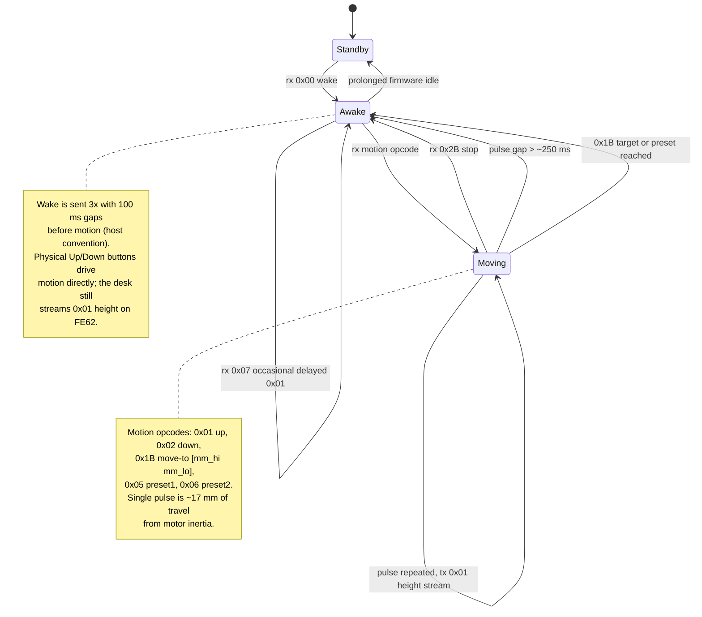
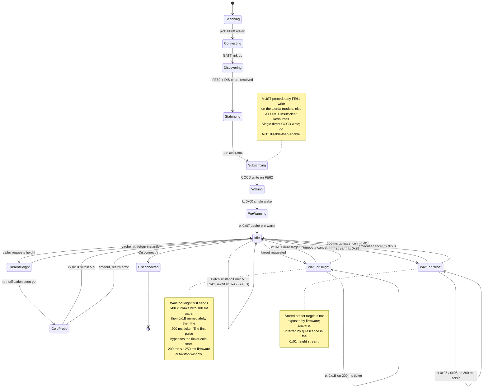

# Yaasa / Jiecang FE60 BLE protocol

Reverse-engineered from a Yaasa Frame Expert (Jiecang FE60 controller, Lierda
LSD4BT-E95ASTD001 BLE module) running the Yaasa OEM firmware. The same protocol
is used by Uplift Desk and other Jiecang-based standing desks, but firmware
variants differ — most notably which opcodes the desk responds to and whether
height is reported in whole millimetres or tenths of a millimetre.

This document records what works on Yaasa firmware. Where Uplift firmware
behaves differently, the difference is called out inline.

## Hardware stack

```
┌──────────────┐   UART  ┌──────────────────────┐   BLE  ┌──────────┐
│  Jiecang     │ ◀─────▶ │  Lierda              │ ◀────▶ │  Host    │
│  FE60 ctrl   │  RJ12   │  LSD4BT-E95ASTD001   │  GATT  │ (this    │
│              │  9600   │  (BLE bridge)        │        │  code)   │
└──────────────┘         └──────────────────────┘        └──────────┘
```

The desk controller speaks a serial protocol over an RJ12 cable. The Lierda
BLE module bridges that UART to BLE GATT. Every quirk we deal with — CCCD slot
exhaustion, ATT 0x11 errors, the requirement to subscribe before writing — is a
quirk of the *Lierda module*, not the desk firmware itself.

## GATT layout

| UUID (16-bit) | Properties               | Purpose                           |
|---------------|--------------------------|-----------------------------------|
| `0xFE60`      | service                  | Desk control service              |
| `0xFE61`      | write-without-response   | Command channel (host → desk)     |
| `0xFE62`      | notify                   | Response / event channel          |
| `0xFE63`      | read                     | Device name string, e.g. `YAASA_HS_11E161` |

Plus the standard Device Information service: Manufacturer, Model, Serial,
Firmware/Hardware/Software revision strings.

`FE62` is notify-only on Yaasa firmware — GATT Read on it returns
`Read Not Permitted`. There is no fallback path that bypasses the CCCD
subscription.

There is no BLE-classic pairing. The link is GATT-only; macOS does not list the
desk in its Bluetooth preferences pane, so there is nothing to "forget" there.

## Frame format

Both directions use the same outer framing:

```
Command  (FE61):   F1 F1  [opcode]  [payloadLen]  [...payload]  [checksum]  7E
Response (FE62):   F2 F2  [opcode]  [payloadLen]  [...payload]  [checksum]  7E
```

`checksum = (opcode + payloadLen + sum(payload)) & 0xFF`

Multiple response frames may arrive concatenated in a single FE62 attribute
value, so the parser must scan the buffer for `F2 F2` boundaries and validate
each frame's checksum and `7E` terminator independently — see
[`internal/protocol.DecodeResponses`](../internal/protocol/packet.go).

## Opcodes

The Yaasa column shows whether the opcode is observed to work on Yaasa OEM
firmware. "delayed" means a response may arrive several seconds after the
command — useful as a probe, unreliable as a guaranteed query.

### Commands (TX on FE61)

| Op   | Name                     | Payload                | Yaasa | Notes                                                                 |
|------|--------------------------|------------------------|-------|-----------------------------------------------------------------------|
| 0x00 | Wake                     | —                      | yes   | Sent 3× with 100 ms gaps before any motion                            |
| 0x01 | Move-up pulse            | —                      | yes   | One pulse → ~17 mm of travel due to motor inertia                     |
| 0x02 | Move-down pulse          | —                      | yes   | Same inertia caveat                                                   |
| 0x03 | Save current → preset 1  | —                      | yes   |                                                                       |
| 0x04 | Save current → preset 2  | —                      | yes   |                                                                       |
| 0x05 | Go to preset 1           | —                      | yes   | Continuous direction — must re-send every 200 ms while moving         |
| 0x06 | Go to preset 2           | —                      | yes   | Same as 0x05                                                          |
| 0x07 | Request height limits    | —                      | weak  | Sometimes triggers a delayed (~4 s) 0x01 height response; usually not |
| 0x0C | Set height range         | (varies)               | no    | Uplift firmware only                                                  |
| 0x0E | Set units (cm / inch)    | `[01]` or `[00]`       | no    | Uplift firmware only                                                  |
| 0x19 | Touch / one-touch mode   | (varies)               | no    | Uplift firmware only                                                  |
| 0x1B | Move to absolute height  | `[mm_hi, mm_lo]` (BE)  | yes   | Whole mm, not tenths. Continuous — re-send every 200 ms while moving  |
| 0x25..0x28 | Save / use preset 3-6 | —                     | no    | Uplift firmware only                                                  |
| 0x2B | Stop                     | —                      | yes   | Halts movement immediately                                            |
| 0xA2 | Request sit/stand time   | —                      | yes   | Yaasa/Jiecang-specific; real-time counter                             |

### Notifications (RX on FE62)

| Op   | Name             | Payload                                | Notes                                                                                            |
|------|------------------|----------------------------------------|--------------------------------------------------------------------------------------------------|
| 0x01 | Height report    | `[mm_hi, mm_lo, 0x00]`                 | Big-endian whole millimetres. **Only emitted while the desk is moving** on Yaasa firmware        |
| 0x07 | Height limits    | `[min_hi, min_lo, max_hi, max_lo]`     | Rarely observed on Yaasa; documented for Uplift                                                  |
| 0xA2 | Sit/stand time   | `[standH, standM, standS, sitH, sitM, sitS]` | Plain binary HH:MM:SS — **not BCD**. Each counter is the live accumulated time         |
| 0xAA | All-time stats   | (firmware-specific)                    | Yaasa firmware; not real-time, do not use for live counters                                      |

## Desk firmware state model

The Jiecang FE60 controller as observed over BLE. Transitions are labelled with
the frames exchanged on FE61 (rx, host → desk) and FE62 (tx, desk → host).



Notes:
- The Lierda BLE bridge has its own ~30 s idle timeout; the host keep-alive
  (`0x07` every 5 s) is needed to keep the BLE link up regardless of the desk
  controller's own state. Wake state (above) and BLE link state are separate
  concerns.
- "Pulse repeated" applies to the *same* motion opcode. The desk treats
  `0x1B`, `0x05`, `0x06` as continuous direction commands; if pulses stop the
  motor stops, but the controller stays Awake.

## Height encoding

`payload[0:2]` of a `0x01` notification is the height as a big-endian uint16 in
**whole millimetres**. `payload[2]` is always `0x00` (reserved).

The uplift-ble project documents the payload as `payload[1:3] / 10` (tenths of
mm). That is **incorrect for Yaasa firmware**. Ground truth: a desk physically
measured at 793 mm sends `03 19 00`, and `0x0319 == 793`. Reading the same
bytes as `0x1900 / 10` gives 640, which is wrong.

The move-to-height command (`0x1B`) takes the same encoding on the way out:
`payload[0:2]` big-endian whole millimetres.

## Connection sequence

```
GATT connect
DiscoverServices: [FE60, DeviceInformation]
For FE60:  discover FE61, FE62, FE63 ── read FE63 ── store as Info.DeviceName
For DIS:   read Manufacturer/Model/Serial/Firmware/Hardware/Software strings
Wait ~300 ms                      ← BLE link stabilisation; required on Lierda
Subscribe to FE62 (CCCD write)    ← MUST happen before any FE61 write
Wake (single 0x00 on FE61)        ← wakes the desk; replies are now captured
```

Two ordering rules matter on the Lierda module:

1. **Subscribe to FE62 BEFORE the first FE61 write.** If any FE61 write
   precedes the CCCD write, the CCCD write is rejected with ATT 0x11
   (`Insufficient Resources`) and notifications never start. Bleak (Python)
   works on this firmware specifically because it subscribes first; our Go
   code must do the same.

2. **Subscribe with a single direct call — do not "clear stale CCCD" first.**
   An earlier version of this code wrote CCCD = 0 (`EnableNotifications(nil)`)
   before re-subscribing, on the theory that it freed a stuck slot. On Yaasa
   firmware the disable succeeds, then the subsequent enable returns ATT 0x11,
   and the desk's CCCD stays cleared — every later height query gets nothing
   back. A single direct subscribe matches what Bleak does and works
   reliably. See `tinygoConnection.EnableNotifications`.

After connect, a 5-second keep-alive (FE61 opcode `0x07`) is enough to prevent
the desk's BLE module from dropping the idle link. The desk does not normally
reply to `0x07` at rest, so this is purely a heartbeat.

## Reading height

There is no opcode that reliably returns the current height at rest on Yaasa
firmware. Height notifications (`0x01`) only stream during actual movement.

The library handles this with a cache-first strategy:

| State                                              | Path                                                                                                                                                            |
|----------------------------------------------------|-----------------------------------------------------------------------------------------------------------------------------------------------------------------|
| Any notification has been received since connect   | Return cached value instantly. Cache is updated by every `0x01` notification                                                                                    |
| Cold start, no notification yet                    | Send `0x07` and wait up to 5 s for the *occasional* delayed `0x01` response; if it doesn't arrive, error out and ask the caller to run any motion command first |

Any motion command (up/down/preset/move) produces a burst of notifications
that warms the cache. Pressing the physical Up/Down buttons on the desk also
produces notifications over the same channel, so manual adjustments are
reflected in the cache without any host-side action.

## Move sequence (move-to-height)

```
wake  (0x00 × 3, 100 ms apart)
0x1B [mm_hi, mm_lo]                ← first pulse immediately (no 200 ms gap)
loop every 200 ms while not at target:
   0x1B [mm_hi, mm_lo]             ← keep pulsing; without this the desk stops
on height notification near target → 0x2B (stop)
```

The desk treats `0x1B` as a continuous direction command, not a one-shot. If
the pulses stop, the desk stops within ~250 ms.

## Preset sequence (go to stored preset)

```
wake
0x05 or 0x06                       ← first preset pulse
loop every 200 ms while moving:
   0x05 or 0x06
quiescence (no notification for 500 ms) → 0x2B (stop)
```

Same continuous-pulse rule as move-to-height. Arrival is detected by
quiescence (no height notification for the quiescence window) rather than
by hitting a target value, because the preset's stored height is not exposed
to the host.

## Sit/stand counters

`0xA2` on FE61 elicits a `0xA2` notification with a 6-byte payload:

```
[standH standM standS  sitH sitM sitS]
```

Each byte is a **plain binary integer** (HH:MM:SS), not BCD. Confirmed on
hardware by sitting for exactly 48 seconds and observing `sitS` increment by
48. The counters update live in firmware; each request returns the current
second.

## Client state machine (yaasa-go)

How this library drives the desk. Each transition shows the FE61 commands the
client emits and the FE62 frames it consumes. The `Idle` state is the steady
state after a successful connect; everything else is either setup or one of
three motion / query workflows.



Interface layering (top consumer → BLE wire):

```
cmd/yaasa CLI     clib (C lib)     internal/ipc daemon
        \             |                /
         \            v               /
          ---->   desk.Desk   <-------
                      |
              (Connection iface)
                      |
                      v
              TinygoAdapter
              darwin: cbgo direct
              other:  tinygo.org/x/bluetooth
                      |
                      v
        CoreBluetooth (macOS) / BlueZ (Linux)
                      |
              GATT FE61 write / FE62 notify
                      |
                      v
        Lierda LSD4BT-E95ASTD001 BLE module
                      |
              UART @ 9600 bps over RJ12
                      |
                      v
        Jiecang FE60 controller --> motor
```

`desk.Desk` owns the protocol logic (pulse cadence, arrival detection, caches,
listener fanout). `desk.Connection` is the narrow GATT interface every adapter
implements: `WriteCommand`, `EnableNotifications`, `ReadResponse`, `Disconnect`.
The split keeps the FE60 protocol code stack-agnostic so the same `Desk` works
against `cbgo` on macOS and the upstream tinygo stack everywhere else.

## Firmware-quirk reference

These all stem from the Lierda LSD4BT-E95ASTD001 BLE module, not the Jiecang
desk controller. Symptoms and recovery:

| Symptom                                                                       | Cause                                                               | Recovery                                                                                                                                                    |
|-------------------------------------------------------------------------------|---------------------------------------------------------------------|-------------------------------------------------------------------------------------------------------------------------------------------------------------|
| CCCD write returns ATT 0x11 (`Insufficient Resources`), no notifications flow | Lierda CCCD slot exhausted by accumulated stale subscriptions       | **Power-cycle the desk: mains off for ≥ 30 s, then on.** A factory reset of the desk controller is not enough — only loss of power resets the Lierda module |
| CCCD write returns ATT 0x11, but notifications DO flow                        | Some firmware variants ACK the CCCD with an error but stream anyway | Surface the error for diagnostics; treat it as non-fatal                                                                                                    |
| Wake works, no notifications ever arrive                                      | First FE61 write happened before the CCCD subscription              | Subscribe to FE62 first, then wake                                                                                                                          |
| Notifications stopped mid-session                                             | Disable-then-enable pattern cleared the CCCD                        | Don't write CCCD = 0 before subscribing; use a single direct subscribe                                                                                      |
| Link drops after ~30 s of idle                                                | BLE module's idle timeout                                           | Send `0x07` on FE61 every 5 s as a heartbeat                                                                                                                |

## References

- [librick/uplift-ble](https://github.com/librick/uplift-ble) — Java/Smali
  reverse-engineering of the Uplift Android app. Source of the opcode table,
  though the height encoding documented there is the Uplift variant (tenths
  of mm) and does not match Yaasa firmware.
- [tzermias/deskctl](https://github.com/tzermias/deskctl) — Linux Bleak-based
  reference implementation.
- [Bennett-Wendorf/uplift-desk-controller](https://github.com/Bennett-Wendorf/uplift-desk-controller)
  — Python BLE library for Uplift desks.
- [Bleak](https://github.com/hbldh/bleak) — Python BLE library that
  successfully subscribes to FE62 on macOS and serves as the behavioral
  reference for what tinygo + cbgo should produce.
